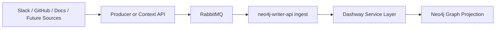

# Dashway Neo4j Graph Backend 진행 정리

## 문서 목적

이 문서는 Dashway에서 Neo4j 기반 그래프 적재 백엔드를 만들기 위해 지금까지 진행한 작업을 정리한 문서다.

정리 범위는 아래와 같다.

- Neo4j 스키마 방향
- `neo4j-writer-api` 구현 상태
- 단일 graph backend의 ingest 구현 상태
- RabbitMQ 기반 비동기 적재 구조
- 현재 검증 결과
- 앞으로 해야 할 작업

---

## 1. 큰 방향

Dashway에서 Neo4j는 원본 저장소가 아니라, 팀 컨텍스트를 구성하는 그래프 projection 역할로 사용한다.

- Slack, GitHub, 문서, 향후 PR/Commit/File 같은 원본 데이터는 source system 또는 별도 canonical 저장소에 유지
- Neo4j에는 개념 중심 관계를 저장
- 핵심 기준점은 `Concept`
- `Decision`은 LLM과 사람 모두가 빠르게 참조할 수 있는 결론 노드로 사용

이 방향 자체는 기존 초안 문서인 `../NEO4J_SCHEMA.md`와 맞춘 상태다.

---

## 2. 지금까지 만든 모듈

현재 활성 그래프 적재 백엔드는 1개다.

### 2.1 `neo4j-writer-api`

위치:

```text
dashway/neo4j-writer-api
```

역할:

- Neo4j에 안전하게 쓰기 위한 Java Spring 백엔드
- 범용 graph write API 제공
- Dashway 스키마 전용 ingest API 제공
- RabbitMQ graph ingest consumer 포함
- REST API와 queue consumer를 하나의 프로세스로 함께 실행

---

## 3. `neo4j-writer-api`에서 한 일

### 3.1 범용 Graph API 구현

구현된 엔드포인트:

- `GET /health`
- `POST /api/graph/nodes`
- `POST /api/graph/relationships`
- `POST /api/graph/batch`

지원 기능:

- 노드 업서트
- 관계 업서트
- 배치 업서트
- Cypher identifier / property validation
- 잘못된 요청에 대한 공통 예외 처리

### 3.2 Dashway 스키마 전용 API 구현

구현된 엔드포인트:

- `POST /api/dashway/admin/bootstrap`
- `POST /api/dashway/concepts`
- `POST /api/dashway/people`
- `POST /api/dashway/channels`
- `POST /api/dashway/repos`
- `POST /api/dashway/slack-messages`
- `POST /api/dashway/issues`
- `POST /api/dashway/documents`
- `POST /api/dashway/decisions`
- `POST /api/dashway/ingest/batch`

핵심 특징:

- 단순 노드 저장이 아니라 Dashway 도메인 관계까지 같이 생성
- 예를 들어 Slack 메시지 적재 시 `Channel`, `Person`, `Concept`, `Issue`와의 관계를 함께 생성
- 관련 엔티티가 아직 없어도 stub node를 먼저 만들어서 out-of-order ingest에 어느 정도 견딜 수 있게 구성
- `bootstrap` 엔드포인트로 주요 unique constraint 생성 가능

### 3.3 Writer API 패키지 구조 정리

초기에는 한 패키지에 controller, service, dto, config, exception이 섞여 있었고,
현재는 역할별 패키지로 분리했다.

현재 구조:

- `ai.ssot.dashway.neo4jwriter.config`
  - Neo4j 연결 설정
- `ai.ssot.dashway.neo4jwriter.common`
  - 공통 예외
  - 공통 에러 응답
  - 예외 핸들러
- `ai.ssot.dashway.neo4jwriter.graph`
  - 범용 graph API controller
  - graph service
  - graph DTO
  - Cypher 지원 유틸
- `ai.ssot.dashway.neo4jwriter.dashway`
  - Dashway 전용 controller
  - Dashway 전용 service
  - Dashway 스키마 DTO
  - Dashway batch factory
- `ai.ssot.dashway.neo4jwriter.ingest`
  - RabbitMQ topology 설정
  - queue listener
  - retry / DLQ publisher
  - idempotency
  - 내부 service dispatch
- `ai.ssot.dashway.neo4jwriter.health`
  - health endpoint

이렇게 정리하면서 API 계층, application 계층, contract 계층, support 계층 경계가 더 선명해졌다.

### 3.4 Writer API 검증 결과

완료한 검증:

- `./gradlew --gradle-user-home /Users/vanble/dev/openai/dashway/dashway/.gradle-cache test` 통과
- 로컬 Neo4j에 연결해서 `GET /health` 확인
- 범용 graph write smoke test 확인
- Dashway `bootstrap` 및 `ingest/batch` smoke test 확인

현재 판단:

- 내부용 또는 MVP용 Neo4j writer로는 충분히 쓸 수 있는 상태
- 다만 production ingestion backbone으로 바로 쓰기에는 운영 보강이 더 필요

---

## 4. ingest 통합에서 한 일

### 4.1 Worker 구조 구현

초기에는 별도 Java 프로세스로 만들었고,
현재는 `neo4j-writer-api` 내부 `ingest` 패키지로 흡수했다.

설계 원칙:

- queue consumer는 Neo4j를 직접 조작하지 않는다
- 모든 그래프 적재는 같은 앱 내부 Dashway service를 통해 수행한다
- queue consume, event routing, retry / DLQ, idempotency를 패키지로 분리한다

패키지 구조:

- `ingest.config`
- `ingest.messaging`
- `ingest.messaging.publish`
- `ingest.application`
- `ingest.contract`
- `ingest.idempotency`
- `ingest.support`

### 4.2 RabbitMQ topology 구성

현재 topology:

- exchange: `dashway.graph`
- routing key: `ingest`
- main queue: `dashway.graph.ingest`
- retry exchange: `dashway.graph.retry`
- retry queue: `dashway.graph.ingest.retry`
- retry routing key: `ingest.retry`
- dlq exchange: `dashway.graph.dlx`
- dlq queue: `dashway.graph.ingest.dlq`

처리 흐름:

1. producer가 `dashway.graph` exchange로 이벤트 발행
2. 단일 graph backend가 `dashway.graph.ingest` queue에서 consume
3. 처리 실패 시 retry queue로 publish
4. retry queue TTL 이후 main exchange로 복귀
5. 최대 시도 횟수 초과 시 DLQ로 이동

### 4.3 지원 이벤트 타입

현재 지원 이벤트:

- `concept.upsert`
- `person.upsert`
- `channel.upsert`
- `repo.upsert`
- `slack.message.upsert`
- `issue.upsert`
- `document.upsert`
- `decision.upsert`
- `dashway.ingest.batch`

이 이벤트들은 같은 앱 안에서 Dashway service 계층으로 직접 dispatch된다.
즉, HTTP hop 없이 queue payload를 내부 service로 변환해 Neo4j까지 반영한다.

### 4.4 Idempotency 현재 상태

현재 구현:

- in-memory TTL store 기반

현재 한계:

- backend 재시작 시 processed event 정보 유실
- 멀티 인스턴스 환경에서 중복 처리 방지가 안 됨

즉, 지금 구현은 개발용 또는 단일 인스턴스 환경에는 충분하지만 production용으로는 부족하다.

### 4.5 ingest 기능 검증 결과

완료한 검증:

- `./gradlew --gradle-user-home /Users/vanble/dev/openai/dashway/dashway/.gradle-cache test` 통과
- 단일 backend 기준 컴파일 및 테스트 확인

미완료 검증:

- RabbitMQ를 통한 완전한 end-to-end live consume 검증

사유:

- 현재 로컬 Docker 환경에서 RabbitMQ 컨테이너가 `no space left on device` 문제로 정상 기동되지 않음
- 코드 레벨 문제라기보다 로컬 Docker 저장공간 문제

---

## 5. Docker Compose 상태

상위 폴더 `docker-compose.yml`에 아래 인프라를 포함시켰다.

- `neo4j`
- `neo4j-seed`
- `rabbitmq`

현재 상태:

- Neo4j는 동작 검증 완료
- RabbitMQ는 compose 정의까지는 반영됨
- RabbitMQ entrypoint에서 Erlang cookie 처리도 보정함
- 다만 현재 로컬 환경에서는 Docker 디스크 부족 때문에 실기동 검증이 막혀 있음

---

## 6. 현재 아키텍처 요약



설계 의도는 아래와 같다.

- source system과 graph projection을 분리
- Neo4j를 직접 만지는 주체를 제한
- retry, DLQ, replay, backfill을 비동기 구조 위에서 쉽게 다루기
- 별도 backend를 하나 더 두지 않고 단일 Spring 앱으로 운영 복잡도를 낮추기

---

## 7. 지금 상태에서 가능한 것

현재 이미 가능한 일:

- Dashway 스키마에 맞는 graph write API 사용
- `Concept`, `Person`, `Channel`, `Repo`, `SlackMessage`, `Issue`, `Document`, `Decision` 업서트
- batch ingest
- 같은 앱 안에서 queue consume과 graph write 동시 실행
- RabbitMQ 기반 retry / DLQ 구조 준비
- 단일 backend 안에서 API / ingest 패키지 구조 확보

---

## 8. 아직 부족한 점

### 8.1 운영 안정성

- persistent idempotency 미구현
- 이벤트 버전 관리 미구현
- 오래된 이벤트가 최신 값을 덮어쓰지 않도록 하는 보호장치 부족
- producer 쪽 outbox / publisher 부재
- metric / tracing / alerting 미구현

### 8.2 보안 및 경계

- writer API 인증 미구현
- 외부 서비스가 Neo4j에 직접 쓰지 못하도록 네트워크 경계 설계 필요

### 8.3 스키마 확장

현재 스키마는 Dashway 초안 관점에서는 핵심만 반영되어 있다.
향후 아래 엔티티를 더 추가할 수 있다.

- `PullRequest`
- `Commit`
- `File`
- `CalendarEvent`
- `Workspace`
- `Team`

### 8.4 통합

- `context-api` 또는 source collector에서 RabbitMQ로 이벤트를 발행하는 publisher 경로가 아직 없음
- 즉, consume 쪽은 만들어졌지만 실제 production ingest 파이프라인은 아직 완결되지 않음

---

## 9. 앞으로 해야 할 일

아래 순서로 진행하는 것이 가장 현실적이다.

### 9.1 1순위: 로컬 end-to-end 검증 마무리

- Docker 저장공간 정리
- RabbitMQ 정상 기동 확인
- 단일 backend + RabbitMQ + Neo4j를 함께 띄워서 실제 메시지 consume 검증
- DLQ / retry 동작 검증

이 단계가 끝나야 지금 구조가 실제로 안정적으로 이어지는지 확인할 수 있다.

### 9.2 2순위: producer / publisher 붙이기

후보:

- `context-api`에서 이벤트 발행
- 별도 collector 서비스에서 이벤트 발행
- outbox polling publisher 모듈 추가

권장 방향:

- 처음에는 `context-api` 또는 source collector가 RabbitMQ에 정규화된 graph event를 발행
- 단일 graph backend가 이를 consume해서 내부 Dashway service로 반영

### 9.3 3순위: idempotency 영속화

권장 선택지:

- Redis 기반 processed event store
- Postgres 기반 processed event store

필수 이유:

- backend 재시작 이후 중복 적재 방지
- 멀티 인스턴스 ingest 확장 대비

### 9.4 4순위: 이벤트 버전 및 최신성 보호

추가할 항목:

- `eventId`
- `sourceEventId`
- `occurredAt`
- `version`
- `updatedAt`

필수 로직:

- 더 오래된 이벤트는 최신 노드를 덮어쓰지 못하게 방지
- 같은 이벤트는 여러 번 들어와도 안전하게 무시 가능하도록 구성

### 9.5 5순위: 관측성과 장애 대응

추가할 것:

- 처리 성공 / 실패 메트릭
- event type별 처리량 메트릭
- retry 횟수 메트릭
- DLQ 적재 건수 추적
- writer API latency / error rate 측정

### 9.6 6순위: writer API 보안

추가할 것:

- internal token 또는 service-to-service auth
- allowed caller 제한
- 운영 환경 secret 관리

### 9.7 7순위: Dashway 스키마 확장

다음으로 확장 가치가 큰 엔티티:

1. `PullRequest`
2. `Commit`
3. `File`
4. `CalendarEvent`

이 단계가 되면 Dashway가 말하는 "Thread -> Issue -> PR -> Decision" 흐름을 더 촘촘하게 연결할 수 있다.

---

## 10. 추천 다음 액션

현재 시점에서 가장 좋은 다음 액션은 아래 3개다.

1. Docker 공간 정리 후 RabbitMQ live consume 검증
2. `context-api` 또는 별도 publisher에서 RabbitMQ로 event 발행하는 경로 추가
3. ingest idempotency를 Redis 또는 Postgres 기반으로 교체

이 3개를 끝내면 Dashway 그래프 적재 파이프라인은 MVP를 넘어 실제 내부 운영용 구조에 가까워진다.

---

## 11. 한 줄 결론

지금까지의 작업으로 Dashway용 단일 graph backend와 RabbitMQ 기반 ingest 뼈대는 이미 갖춰졌다.
이제 남은 핵심은 "실제 producer 연결", "영속 idempotency", "운영 검증"이다.
