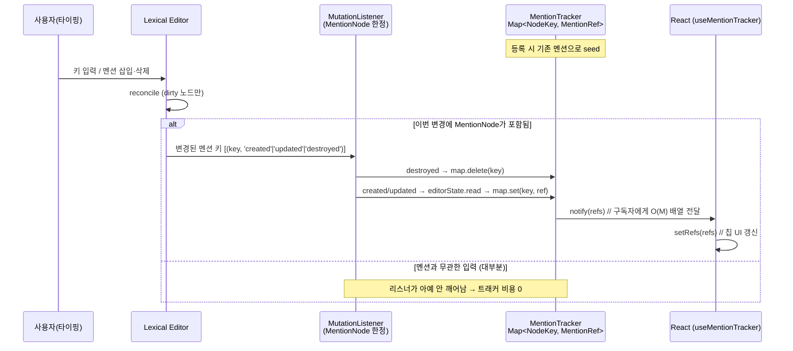

# @dashway/rich-text

Lexical 위에 올린 **헤드리스(UI 없음) 리치텍스트 핵심 로직** 패키지.
직렬화 포맷 · 멘션 · 검증 · 추출을 **한 곳에서 정의**해, chat 등 여러 앱이
각자 포크하지 않고 같은 규약을 공유한다.

> 이 패키지는 리치텍스트 도메인 타입(`MentionTarget`, `MentionTargetType`,
> `SerializedMentionNode`)의 **단일 출처(single source of truth)**다. 포크하지
> 말고 `@dashway/rich-text`에서 import 할 것.

이제 이 패키지는 데이터 규약뿐 아니라 **에디터 UI(`<RichTextEditor>`)와 읽기 렌더러
(`renderLexical`)까지** 소유한다. 각 앱은 Lexical을 재조립하지 않고 import만 한다.

---

## 진입점 (Entry Points)

목적별로 4개의 진입점이 있다. 필요한 것만 import해 런타임 의존성을 최소화한다.

| 진입점 | 용도 | 주요 export | 런타임 의존성 |
|--------|------|------------|--------------|
| `@dashway/rich-text` | **순수 데이터** (검증·추출·타입). 서버/RSC 안전 | `validate` · `extract` · `serialize 타입` · 도메인/AST 타입 · 상수 · `fromSearchFn` | 없음 (lexical은 타입만) |
| `@dashway/rich-text/react` | **직렬화·노드·증분 추적** | `MentionNode` · `$createMentionNode` · `serialize` · `deserialize` · `createMentionTracker` · `useMentionTracker` | lexical + react |
| `@dashway/rich-text/render` | **읽기**(저장된 글 표시) | `renderLexical` · `MentionRender` · `CodeBlockRender`(opt-in, shiki) · `MENTION_TYPE_CLASSES` | react (+ @dashway/ui) |
| `@dashway/rich-text/editor` | **편집**(작성 UI) | `<RichTextEditor>` · `createEditorConfig` · 플러그인 · `MentionTypeaheadPlugin` · `insertMention*` | lexical + react + @dashway/ui |

> core(`.`)와 `/render`는 **런타임 클린**(에디터 런타임 미포함)으로 유지된다 —
> `validate()`만 쓰려는 서버 소비자가 Lexical/React를 끌어오지 않도록.

---

## 다른 앱에서 사용하기 (Integration)

### 1. 의존성
```jsonc
// 앱 package.json
"dependencies": {
  "@dashway/rich-text": "workspace:*",
  "@dashway/ui": "workspace:*"   // /editor·/render의 기본 UI(Button)가 사용
}
```

### 2. 모듈 해석 — `resolve.dedupe`가 가장 중요
Lexical 인스턴스가 중복되면 `instanceof`/노드 등록이 깨져 에디터가 통째로 죽는다.
vite/vitest 양쪽에 dedupe를 넣을 것:
```ts
// vite.config.ts / vitest.config.ts
resolve: {
  dedupe: ['lexical', '@lexical/code', '@lexical/html', '@lexical/link',
           '@lexical/list', '@lexical/markdown', '@lexical/react',
           '@lexical/rich-text', 'react', 'react-dom'],
}
```
Vite는 패키지 `exports`로 서브패스를 자동 해석하므로 **alias 불필요**. TS는 `paths`에
4개 서브패스를 매핑(상대경로는 앱 위치에 맞게):
```jsonc
// tsconfig.json — 서브패스를 bare보다 먼저
"paths": {
  "@dashway/rich-text/editor": ["../../../packages/rich-text/src/editor/index.ts"],
  "@dashway/rich-text/render": ["../../../packages/rich-text/src/render/index.ts"],
  "@dashway/rich-text/react":  ["../../../packages/rich-text/src/react.ts"],
  "@dashway/rich-text":        ["../../../packages/rich-text/src/index.ts"]
}
```
vitest를 쓰면 같은 4개를 `resolve.alias`에도(더 구체적인 서브패스를 먼저) 추가.

### 3. Tailwind `@source` (클래스 purge 방지 — 필수)
패키지 소스의 유틸 클래스(멘션 색상·타입어헤드·코드블록)가 빌드에서 사라지지 않도록,
앱 CSS(`@import "tailwindcss"` 파일)에 추가:
```css
@source "../../../../packages/rich-text/src/render";
@source "../../../../packages/rich-text/src/editor";
```

### 4. 테마
- `@dashway/design-tokens`를 쓰는 앱(`border-border`·`bg-muted`·`text-primary` 등) →
  **기본 테마가 그대로 동작**.
- 팔레트가 다른 앱 → `<RichTextEditor theme={...}>` / `renderLexical(doc, { classes })`로 오버라이드.

### 5. 편집 — `<RichTextEditor>`
```tsx
import { RichTextEditor, type RichTextEditorHandle } from '@dashway/rich-text/editor'
import type { MentionTarget } from '@dashway/rich-text'

const ref = useRef<RichTextEditorHandle>(null)

<RichTextEditor
  ref={ref}
  namespace="doc-editor"
  placeholder={<div className="...">내용을 입력하세요</div>}   // ReactElement
  mentionSearch={async ({ query, limit }) => search(query, limit)}  // 함수 주입(아래 7)
  onChange={(state) => saveDraft(state)}                       // 선택
  onSubmit={(content, plainText) => send(content, plainText)}  // Enter 전송(선택)
  onFilesPasted={(files) => attach(files)}                     // 선택
  theme={appTheme}                                             // 다른 팔레트면(선택)
/>

// ref로 제어:
const content = ref.current?.getSerializedState()
const text = ref.current?.getPlainText()
ref.current?.clear()
```
LexicalComposer + 플러그인 스택(history/list/link/markdown/IME/emoji/paste/mention)이
이미 묶여 있다.

### 6. 읽기 — `renderLexical`
```tsx
import { renderLexical, CodeBlockRender } from '@dashway/rich-text/render'

renderLexical(message.content, {
  components: { code: CodeBlockRender },  // shiki 코드블록(미주입 시 plain <pre>)
  membersById,                            // person 멘션 이름 해석(선택)
  classes: { quote: '...' },              // 노드별 클래스 오버라이드(선택)
})
```

### 7. 멘션 검색 주입 (P3)
`mentionSearch`는 함수다 — 앱이 자기 데이터 소스를 연결:
```ts
async function search(query: string, limit: number): Promise<MentionTarget[]> {
  const rows = await directory.search(query, limit)
  return rows.map((r) => ({ type: 'person', id: r.id, label: r.name, source: 'People' }))
}
```
결과 목록 UI를 바꾸려면 `<RichTextEditor mentionResultRenderer={MyList} />`.

### 통합 체크리스트
- [ ] `@dashway/rich-text` + `@dashway/ui` 의존성 + `pnpm install`
- [ ] vite/vitest `resolve.dedupe`에 lexical·@lexical/*·react·react-dom (**가장 흔한 함정**)
- [ ] tsconfig `paths`(+ vitest alias) 4개 서브패스
- [ ] Tailwind `@source` 2줄(render·editor)
- [ ] 디자인토큰 미사용 시 `theme`/`classes` 오버라이드

---

## 설계 철학 (3 Principles)

코드 주석에 박혀 있는 세 가지 원칙이 전체 구조를 지배한다.

| # | 원칙 | 의미 |
|---|------|------|
| **P1** | **편집 경로엔 전체 트리 순회 금지** (zero tree-walk) | 키 입력마다 `O(N)` 순회를 돌면 긴 문서에서 타이핑이 느려진다. 편집 중 "멘션이 뭐가 있나"는 **증분 추적**으로 답한다. |
| **P3** | **검색 fetcher는 주입받는다** | 멘션 후보를 *어디서* 가져오는지는 앱의 관심사. 패키지는 인터페이스만 정의하고 구현은 주입받는다. |
| — | **타입은 단일 출처** | 도메인 타입을 한 곳에서 정의, 앱은 re-export. |

> P1은 **편집 경로에만** 적용된다. 저장/검증은 어차피 가끔 도는 거라 단순·정확함을
> 택했다 (아래 [3개 경로](#핵심-멘탈-모델--3개의-경로) 참고).

---

## 핵심 멘탈 모델 — "3개의 경로"

리치텍스트를 다루는 상황을 셋으로 분리하고, 각각 **다른 성능 규칙**을 적용한다.

```
                      ┌──────────────────────────────────────────────┐
                      │              @dashway/rich-text               │
                      └──────────────────────────────────────────────┘

  ① LOAD / SAVE           ② EDITING                  ③ DERIVE / READ
  (저장·불러오기)          (타이핑 중)                 (목록·검색 렌더)
  ───────────────         ───────────────            ───────────────
  serialize               MentionTracker             extract
  deserialize             useMentionTracker          ├ plain
  validate                                           ├ excerpt(280자)
                                                      ├ mentions
  전체 순회 OK            전체 순회 금지(P1)           └ highlightSlice
  (드물게 1회)            증분 O(ΔM)
```

| 경로 | 언제 | 모듈 | 성능 규칙 |
|------|------|------|-----------|
| **① Load/Save** | 메시지 전송, DB 읽기 | `serialize` · `deserialize` · `validate` | 전체 순회 **허용** (1회성) |
| **② Editing** | 키 입력마다 | `MentionTracker` · `useMentionTracker` | 전체 순회 **금지**, 증분 |
| **③ Derive/Read** | 미리보기·검색 렌더 | `extract` | 렌더 1패스 |

---

## Public API

진입점별로 정리한다.

```ts
// ── @dashway/rich-text (core, 런타임 클린) ───────────────────────────
extract(doc, opts?): ExtractedRichText           // plain/excerpt/mentions/highlight
validate(doc): ValidationResult                  // size/depth/node 화이트리스트
fromSearchFn(fn): MentionSearchProvider          // 검색 주입 seam (P3)
CURRENT_SCHEMA_VERSION, EXCERPT_LIMIT, MAX_DOCUMENT_BYTES,
MAX_DOCUMENT_DEPTH, NODE_WHITELIST
// 타입: MentionTarget, MentionTargetType, MentionRef, RichTextDocument,
//      ExtractedRichText, 직렬화 AST 노드 타입(SerializedMentionNode 등)

// ── @dashway/rich-text/react (직렬화·노드·추적) ──────────────────────
serialize(editor): RichTextDocument
deserialize(editor, doc): EditorState            // 버전 불일치 시 throw
SchemaVersionUnsupportedError
MentionNode, $createMentionNode, $isMentionNode
createMentionTracker(editor): MentionTracker     // 증분 추적 (P1)
useMentionTracker(editor): MentionRef[]          // React hook

// ── @dashway/rich-text/render (읽기 렌더) ────────────────────────────
renderLexical(state, opts?): ReactNode           // AST → React (classes/components 주입)
MentionRender, CodeBlockRender(opt-in, shiki), MENTION_TYPE_CLASSES

// ── @dashway/rich-text/editor (편집 UI) ──────────────────────────────
RichTextEditor(props), RichTextEditorHandle      // 조립형 에디터 컴포넌트
createEditorConfig(opts), DEFAULT_EDITOR_THEME
MentionTypeaheadPlugin, EmojiReplacePlugin, ImeGuardPlugin, PasteSanitizerPlugin
insertMentionAtCapturedRange, insertMentionAtCurrentSelection, MentionResultList
```

---

## 편집은 어떻게 도는가 (Editing Flow)

핵심은 **"키 입력마다 전체 트리를 걷지 않는다"**는 것이다. Lexical의
`registerMutationListener`가 **변경된 `MentionNode`만** 통지하고, 트래커는
`Map<NodeKey, MentionRef>`를 **증분 갱신**한다.

### 시퀀스



### 데이터 흐름 (ASCII)

```
   타이핑
     │
     ▼
 ┌─────────┐   변경된 MentionNode만   ┌──────────────────────────┐
 │ Lexical │ ───────────────────────▶ │ registerMutationListener │
 └─────────┘   (멘션 무관 입력이면      └──────────┬───────────────┘
               통지조차 안 됨)                     │ created/updated → read 1개 노드
                                                   │ destroyed       → map.delete
                                                   ▼
                                       ┌──────────────────────────┐
                                       │  Map<NodeKey,MentionRef>  │  ← O(ΔM) 갱신
                                       └──────────┬───────────────┘
                                       values() = │ O(M)
                                                   ▼
                                       subscribers → React setState → 멘션 칩 UI
```

> **포인트**: `tracker.values()`는 트리가 아니라 **멘션만 담긴 Map**을 읽으므로
> 문서 크기 `N`과 무관하다. `extract({ tracker })`도 이 캐시에서 멘션을 읽어
> **두 번째 전체 순회(`collectMentionsByWalk`)를 건너뛴다** (테스트가 이 함수가
> 호출되지 않음을 검증: AC3/AC9).

---

## 시간 복잡도

### 기호

| 기호 | 의미 |
|------|------|
| `N`  | 문서의 전체 노드 수 |
| `M`  | 멘션 노드 수 (`M ≤ N`) |
| `ΔM` | 한 번의 편집 트랜잭션에서 바뀐 멘션 수 (보통 0 또는 1) |
| `B`  | 직렬화 바이트 크기 (UTF-8) |
| `E`  | 발췌 길이 상수 (280) |
| `S`  | 트래커 구독자 수 |

### 연산별 복잡도

| 연산 | 복잡도 | 비고 |
|------|--------|------|
| `serialize` | `O(N)` | Lexical `toJSON`이 전 노드 순회 |
| `deserialize` | `O(N)` | `parseEditorState`가 전 노드 재구성 |
| `validate` | `O(N + B)` | depth+whitelist 1-walk `O(N)` + 바이트 측정 `O(B)` |
| `extract` (트래커 X) | `O(N)` | `renderPlain` `O(N)` + `collectMentionsByWalk` `O(N)` |
| `extract` (트래커 O) | `O(N)` | `renderPlain` `O(N)` + `values()` `O(M)` — **순회 1회 절약** |
| `tracker` 갱신 (편집당) | `O(ΔM)` | 멘션 무관 입력이면 `O(0)` (리스너 미발화) |
| `tracker.values()` | `O(M)` | Map 값 복사 |
| `notify` (변경 시) | `O(M + S)` | 배열 1회 빌드 + 구독자 통지 |

### 긴 문서를 "읽을 때" — Load 파이프라인

문서를 불러와 화면에 처음 그릴 때의 전체 비용:

```
deserialize        O(N)
  + validate       O(N + B)
  + extract         O(N)        (renderPlain은 트래커 유무와 무관하게 1패스 필요)
────────────────────────────
합계               O(N + B)   ← 노드 수와 바이트 크기에 선형
```

**왜 이게 최적인가**: 문서를 처음 읽으면 모든 노드를 최소 1번은 만져야
한다(재구성 + 평문 렌더). 따라서 읽기의 하한은 `Ω(N)`이고, 위 파이프라인은
`O(N + B)`로 **상수배 안에서 최적**이다. `B` 항은 `validate`의
`JSON.stringify`+`TextEncoder`(바이트 정확 크기 측정)에서 나온다.

> `extract`의 트래커 최적화는 **읽기(load)** 가 아니라 **편집(edit)** 을 위한 것이다.
> load 시엔 살아있는 트래커가 없으니 full-walk 경로(`O(N)`)를 타는 게 맞다.
> `renderPlain`은 평문을 만들어야 하므로 어차피 `O(N)` — 트래커가 절약하는 건
> *멘션 수집용 2번째 순회*일 뿐, 평문 1패스는 아니다.

### 긴 문서를 "편집할 때" — 트래커가 막는 함정

P1이 해결하는 본질적 문제. 키 입력 `K`번을 친다고 할 때:

| 방식 | 편집 1회 | 타이핑 세션(K회) |
|------|----------|------------------|
| **순진하게** 매 입력마다 멘션 재수집 | `O(N)` | `O(K · N)` ← 긴 문서에서 성능 절벽 |
| **트래커**(이 패키지) | `O(ΔM) ≈ O(1)` | `O(K)` ← 문서 크기 `N`과 무관 |

#### 숫자 예시 — `N = 50,000` 노드, `M = 200` 멘션, `B = 256 KB`

- **Load 1회**: `deserialize`+`validate`+`extract` ≈ 노드 5만 개를 3패스 + 256KB
  바이트 스캔. 전부 선형, 불러올 때 1회뿐 → 문제없음.
- **타이핑 1타**: 멘션과 무관한 글자면 트래커 비용 **0** (리스너 미발화),
  Lexical은 dirty 노드 `Δ`개만 reconcile. 멘션을 하나 추가/삭제해도 트래커는
  `O(ΔM)=O(1)` 갱신 + `O(M)=200`개 배열 통지.
  → **5만 노드 문서에서도 타이핑은 노드 수와 무관하게 일정**하다.

---

## 모듈별 "무엇 + 왜"

### `types.ts` / `serialize` / `deserialize` — 직렬화 봉투

```ts
RichTextDocument = { schemaVersion: number, root: SerializedEditorState['root'] }
```
Lexical `root`를 `schemaVersion`으로 감싼 **영속 포맷**. `serialize`는 버전을 찍고,
`deserialize`는 버전을 검사해 안 맞으면 `SchemaVersionUnsupportedError`를 던진다.
호환 안 되는 문서를 조용히 파싱하다 깨지는 사고를 막는 게 목적.

`MentionRef = Pick<MentionTarget, 'id' | 'type' | 'label'>` — 목록/추적용 **경량 참조**와
렌더/검색용 **풀 타깃**을 구분한다.

### `nodes/MentionNode.tsx` — 멘션은 왜 `DecoratorNode`인가

멘션은 **편집 불가·원자적·인라인**이며 **React 칩으로 렌더**돼야 한다 → Lexical에서
그걸 표현하는 게 `DecoratorNode`. `getTextContent()`이 `@label`을 돌려줘 평문 추출과
복사/붙여넣기가 자연스럽다. `exportJSON`/`importJSON`이 멘션의 wire 규약을 정의한다.
`MentionTarget`을 통째로 들고 있어 `person | document | issue | team | app`
**다형 멘션**을 지원한다.

### `tracker.ts` + `react/useMentionTracker.ts` — 증분 추적 (P1)

`editor.registerMutationListener(MentionNode, …)`로 변경된 멘션만 받아
`Map<NodeKey, MentionRef>`를 증분 갱신. `useMentionTracker`는 이를 React state로
미러링하고 언마운트 시 정리한다. (위 [편집 흐름](#편집은-어떻게-도는가-editing-flow) 참고)

### `validate.ts` — 일부러 "최적화 안 한" 결정

주석에 **"validate는 P1에서 제외(EXEMPT)"**라고 명시. 트래커는 멘션만 알지
깊이·노드 종류는 모르기 때문에 트래커로 못 옮긴다. load/save 때만 도니 full-walk가 맞다.

- **size — `.length`가 아니라 UTF-8 바이트**: UTF-16 길이는 한글/CJK·이모지를 ~3배
  적게 센다. 한글 문서가 실제 750KB인데 `.length < 256K`를 통과하는 사고를 막는다.
  **한글 제품이라 바이트 기준이 load-bearing.** (`TextEncoder` 사용 → `@types/node` 불필요)
- **depth ≤ 16**: 병적 중첩 차단.
- **node whitelist**: 허용 노드(paragraph/heading/list/quote/code/link/mention/text)만.
  `table` 같은 건 거부 → 보안·일관성.

### `extract.ts` — 파생 뷰

`{ plain, excerpt(280), mentions, highlightSlice }`. 메시지 미리보기·검색결과에
필요한 것들. `highlightSlice`는 발췌 범위로 클램핑해 멘션을 굵게 표시한다. 결정적이라
픽스처로 검증.

### `search/MentionSearchProvider.ts` — 주입 시점 (P3)

패키지는 fetch 구현을 **일절 안 가진다**. 인터페이스 + `fromSearchFn` 어댑터만 제공.
멘션 후보 출처(지금은 mock directory, 나중엔 context-api)는 앱이 주입한다. mock→live
전환이 호출부 한 줄로 끝난다:

```ts
// apps/chat/frontend .../MessageComposer.tsx
const provider = fromSearchFn(({ query, limit }) =>
  buildMentionTargets(directory, { query, limit: limit ?? 8 }))
```

---

## 테스트 (Golden Fixtures)

순수 함수 계약은 **데이터 기반 골든 픽스처**로 검증한다 (`test/fixtures/`).
파일을 추가하면 케이스가 자동으로 늘어난다.

| 폴더 | 검증 | 예 |
|------|------|----|
| `roundtrip/` | 직렬화↔역직렬화 무손실 | 빈 문서, 한글, 멘션, 헤딩, 리스트, 코드, 혼합 … |
| `validate/accept-*` | 통과해야 하는 문서 | 30개 |
| `validate/reject-*` | 거부해야 하는 문서 | `table` 노드, 한글 초과 크기 … |
| `extract/` | plain/하이라이트 추출 | `highlight-basic`, `long-excerpt` |
| `parity/` | 과거 chat-ui wire 멘션 형식과의 호환(회귀 가드) | `chat-ui-mention.json` |

```bash
pnpm --filter @dashway/rich-text test
```

---

## 로드맵

- ✅ **완료**: 도메인 타입 단일화(구 chat-ui 중복 제거), 읽기 렌더러(`/render`) 및
  에디터 UI(`/editor`, `<RichTextEditor>`)를 패키지로 승격 — chat이 첫 소비자.
- **다음 소비자 연결**: issue_tracker · document 앱에서 `<RichTextEditor>`/`renderLexical`
  채택 (각 앱에 dedupe + `@source` + 팔레트 `theme` 오버라이드 적용 — [통합](#다른-앱에서-사용하기-integration) 참고).
- context-api 기반 `MentionSearchProvider` 구현체 추가 (mock 대체, P3 한 줄 스왑).
